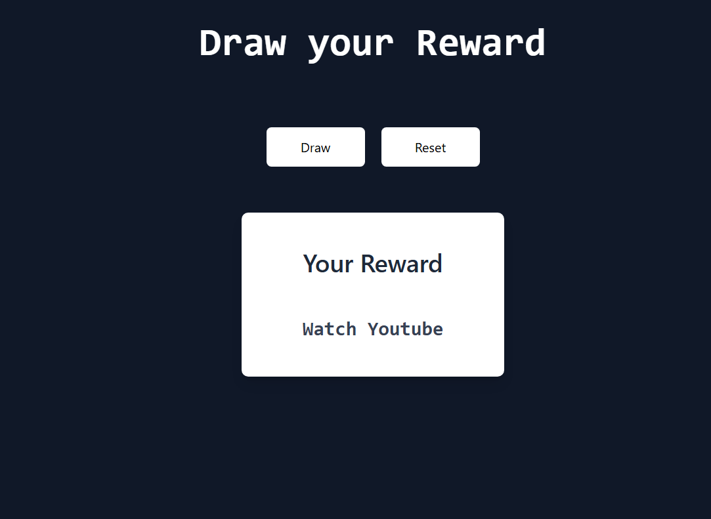

# Draw Your Reward

A simple, fun web Todo app to help you decide what to do during your break! 🎲

This project solves the problem of indecision by letting you draw a random reward activity—like watching YouTube, reading a book, or just doing nothing—at the click of a button.

## Features

- 🎁 **Random Reward Generator**: Click "Draw" to get a random break activity.
- 🔄 **Reset Option**: Clear your result and draw again.
- 🎨 **Modern UI**: Built with React, Vite, and styled using Tailwind CSS.
- 🖥️ **Responsive Design**: Works great on desktop and mobile.

## Demo



## Getting Started

### Prerequisites
- [Node.js](https://nodejs.org/) (v16+ recommended)
- [npm](https://www.npmjs.com/) (comes with Node.js)

### Installation

1. **Clone the repository:**
   ```bash
   git clone <repo-url>
   cd rewards
   ```
2. **Install dependencies:**
   ```bash
   npm install
   ```
3. **Start the development server:**
   ```bash
   npm run dev
   ```
4. **Open your browser:**
   Visit [http://localhost:5173](http://localhost:5173) (or the URL shown in your terminal)

## Usage

- Click the **Draw** button to randomly select a reward for your break.
- The selected reward will be displayed in a card.
- Click **Reset** to clear the result and draw again.

## Customization

Want to add your own rewards?
- Edit the `rewards` array in [`src/App.jsx`](src/App.jsx) to include your favorite break activities!

## Tech Stack
- [React](https://react.dev/)
- [Vite](https://vitejs.dev/)
- [Tailwind CSS](https://tailwindcss.com/)

## Project Structure

```
rewards/
├── public/           # Static assets
├── src/
│   ├── App.jsx       # Main app component
│   ├── main.jsx      # Entry point
│   ├── calendar.jsx  #Calendar functions
│   ├── index.css     # Tailwind CSS import
│   └── assets/       # Images, Icons
├── index.html        # HTML template
├── package.json      # Project metadata & scripts
└── README.md         # This file
```

## Scripts
- `npm run dev` — Start development server
- `npm run build` — Build for production
- `npm run preview` — Preview production build
- `npm run lint` — Lint code


